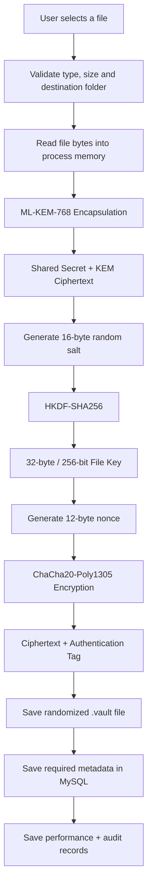
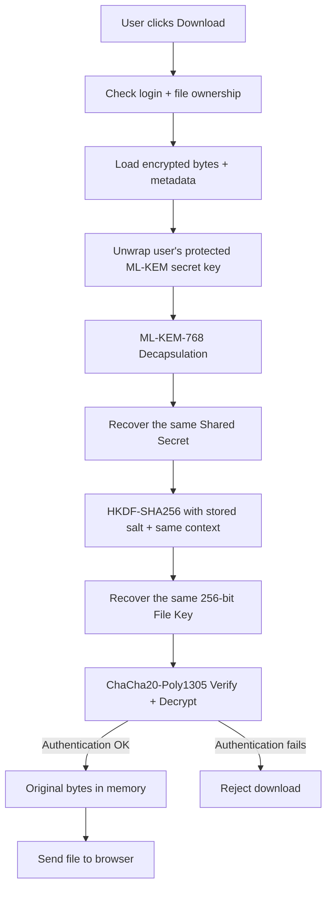
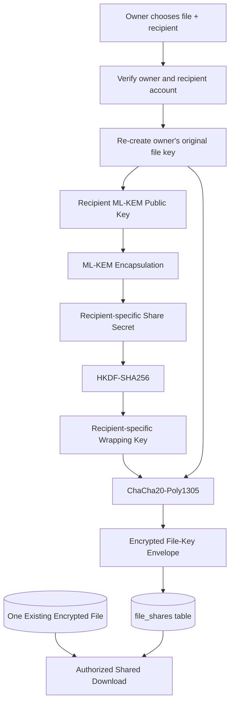
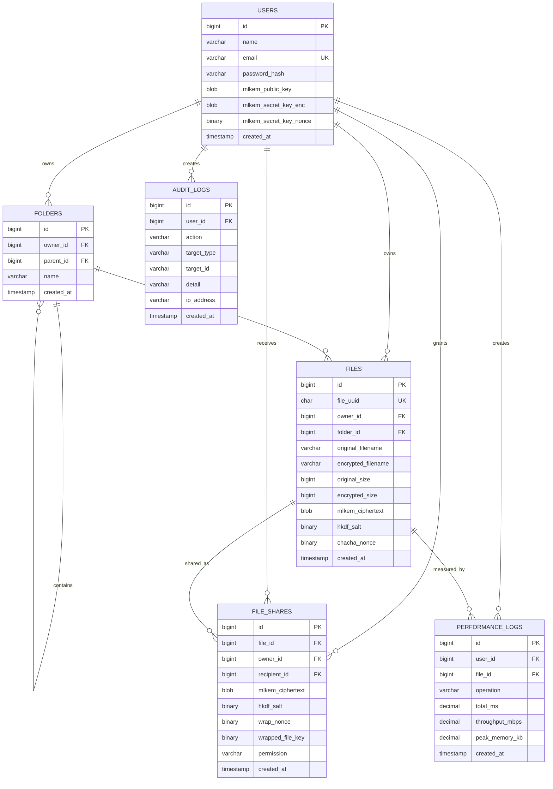

# 🔐 QuantumVault
## Drive-Style Post-Quantum Secure File Vault & Document Management System

> **QuantumVault** is an educational and research-oriented secure file-management web application.  
> It gives users a clean, familiar file-manager experience while demonstrating what happens underneath modern and post-quantum cryptography.

---

## ✨ In one sentence

QuantumVault lets a user **create folders, upload files, create encrypted text files, move/rename/delete items, securely share files, download them after decryption, and visually replay the cryptographic steps used to protect the data**.

---

## 📌 Table of Contents

- [1. What is QuantumVault?](#1-what-is-quantumvault)
- [2. Why this project exists](#2-why-this-project-exists)
- [3. Main features](#3-main-features)
- [4. User interface idea](#4-user-interface-idea)
- [5. System architecture](#5-system-architecture)
- [6. How file upload and encryption work](#6-how-file-upload-and-encryption-work)
- [7. How download and decryption work](#7-how-download-and-decryption-work)
- [8. How secure sharing works](#8-how-secure-sharing-works)
- [9. What each cryptographic algorithm does](#9-what-each-cryptographic-algorithm-does)
- [10. What is stored in the database and on disk](#10-what-is-stored-in-the-database-and-on-disk)
- [11. Database structure](#11-database-structure)
- [12. Project structure](#12-project-structure)
- [13. Requirements](#13-requirements)
- [14. Quick start](#14-quick-start)
- [15. Database setup](#15-database-setup)
- [16. Environment configuration](#16-environment-configuration)
- [17. Install and configure liboqs](#17-install-and-configure-liboqs)
- [18. Run on macOS](#18-run-on-macos)
- [19. Run on Linux](#19-run-on-linux)
- [20. Run on Windows](#20-run-on-windows)
- [21. First-use walkthrough](#21-first-use-walkthrough)
- [22. Using the Crypto Demo](#22-using-the-crypto-demo)
- [23. Performance benchmarking](#23-performance-benchmarking)
- [24. Activity and security logs](#24-activity-and-security-logs)
- [25. File and folder rules](#25-file-and-folder-rules)
- [26. Storage limits](#26-storage-limits)
- [27. Security design](#27-security-design)
- [28. Important limitations](#28-important-limitations)
- [29. Troubleshooting](#29-troubleshooting)
- [30. GitHub checklist](#30-github-checklist)
- [31. Standards and libraries](#31-standards-and-libraries)
- [32. Authors](#32-authors)
- [33. Academic-use note](#33-academic-use-note)

---

# 1. What is QuantumVault?

QuantumVault is a **multi-user encrypted file vault** built with Flask, MySQL, JavaScript, and modern cryptographic libraries.

From the user side, it behaves like a simple cloud file manager:

- create folders;
- open folders;
- upload files;
- create `.txt` files inside the vault;
- move files between folders;
- move folders into other folders;
- rename files and folders;
- delete files;
- delete empty folders;
- search the vault;
- download a file;
- securely share a file with another registered user;
- revoke that sharing permission;
- view files shared with you;
- inspect performance results;
- inspect activity/security logs.

The difference is what happens **under the surface**.

Before a file is permanently stored, QuantumVault uses:

1. **ML-KEM-768** to create post-quantum shared key material.
2. **HKDF-SHA256** to derive a 256-bit file-encryption key.
3. **ChaCha20-Poly1305** to encrypt the file and protect its integrity.

The readable file is not intentionally kept as a permanent file in the server vault directory.

---

# 2. Why this project exists

Many students can use a cryptographic library but still find it difficult to explain:

- where a key came from;
- why a KEM is needed;
- why a KDF is used after a KEM;
- what actually encrypts the file;
- what detects file modification;
- how another user can securely receive access;
- how execution time and memory can be measured.

QuantumVault is designed to solve that educational problem.

The project tries to provide **two things at the same time**:

### A. A usable file-management application

The main workspace is intentionally kept clean, similar to a modern drive application.

### B. A cryptography demonstration tool

When needed, the user can open the **Crypto Demo** and see the encryption/decryption steps in simple or technical mode.

This means the normal UI does not have to be filled with long cryptographic explanations all the time.

---

# 3. Main Features

| Area | Features |
|---|---|
| Account | Register, login, logout, hashed passwords, secure session |
| File Manager | Upload, download, rename, delete, search |
| Folder Manager | Create nested folders, open folders, rename, move, delete empty folders |
| Built-in Creation | Create encrypted `.txt` files directly in the vault |
| Encryption | ML-KEM-768 + HKDF-SHA256 + ChaCha20-Poly1305 |
| Storage | Randomized encrypted server-side filenames |
| Sharing | Share with another registered user using a recipient-specific protected key envelope |
| Revocation | Owner can remove future shared access |
| Shared Files | Recipient can view and download authorized files |
| Demo | On-demand crypto drawer, Simple/Technical modes, replay last operation |
| Performance | Benchmark up to 30 repetitions, timing, throughput, memory, encrypted size |
| Export | Performance records can be exported as CSV |
| Security Logs | Upload, download, share, revoke, folder/file actions, tamper-related events |
| Validation | File type, size, ownership and permission checks |
| Tamper Detection | ChaCha20-Poly1305 authentication failure blocks decryption |

---

# 4. User Interface Idea

The interface is intentionally organized like a modern drive application.

```text
┌────────────────────────────────────────────────────────────────────────────┐
│ QuantumVault            Search in My Vault...          [ Crypto Demo ]     │
├─────────────────┬──────────────────────────────────────────────────────────┤
│ + New           │  My Vault                                                │
│                 │                                                          │
│ My Vault        │  Breadcrumbs                                             │
│ Shared with me  │  My Vault > University > CSE315                          │
│ Performance     │                                                          │
│ Activity log    │  ┌──────────┐  ┌──────────┐  ┌──────────┐                │
│ How it works    │  │ Folder A │  │ Folder B │  │ Folder C │                │
│                 │  └──────────┘  └──────────┘  └──────────┘                │
│                 │                                                          │
│                 │  report.pdf     image.png      notes.txt                 │
│                 │                                                          │
└─────────────────┴──────────────────────────────────────────────────────────┘
```

The **Crypto Demo** stays hidden until the user wants to demonstrate the security process.

---

# 5. System Architecture

### Figure 1 — High-level architecture

```mermaid
flowchart LR
    U[User Browser] --> F[Flask Web Application]

    F --> AUTH[Authentication & Authorization]
    F --> FM[File / Folder Management]
    F --> SHARE[Secure Sharing]
    F --> PERF[Performance Measurement]
    F --> DEMO[Crypto Demo Trace]

    AUTH --> DB[(MySQL Database)]
    FM --> DB
    SHARE --> DB
    PERF --> DB

    F --> CE[Cryptography Engine]

    CE --> KEM[ML-KEM-768]
    CE --> KDF[HKDF-SHA256]
    CE --> AEAD[ChaCha20-Poly1305]

    CE --> ES[(Encrypted File Storage)]

    DEMO -. recorded safe trace .-> U
```



### Simple explanation

- **Browser**: where the user interacts with QuantumVault.
- **Flask**: receives requests and controls application logic.
- **MySQL**: stores users, metadata, folders, shares, logs and performance records.
- **Crypto engine**: performs the cryptographic operations.
- **Encrypted storage**: stores the actual encrypted file bytes.
- **Crypto Demo**: explains the operation without displaying raw secret values.

---

# 6. How File Upload and Encryption Work

### Figure 2 — Upload flow



### Step-by-step in easy words

#### Step 1 — Validate the file

The system first checks that:

- the user is logged in;
- the selected file has an allowed extension;
- the file is not empty;
- the request is not larger than the configured maximum;
- the destination folder belongs to the logged-in user.

#### Step 2 — ML-KEM creates shared secret material

QuantumVault uses the user’s **ML-KEM public key**.

ML-KEM encapsulation creates:

- a hidden **shared secret**;
- a **KEM ciphertext**.

The KEM ciphertext can be stored.  
The shared secret is used temporarily and is not shown to the user.

#### Step 3 — HKDF creates the file key

A fresh random 16-byte salt is generated.

QuantumVault combines:

- ML-KEM shared secret;
- random salt;
- a file-specific context containing the file UUID.

HKDF-SHA256 derives exactly **32 bytes = 256 bits**.

That value becomes the file-encryption key.

#### Step 4 — ChaCha20-Poly1305 protects the file

A fresh **12-byte nonce** is generated.

ChaCha20-Poly1305 receives:

- the 256-bit file key;
- the nonce;
- the file bytes;
- application-specific authenticated data (AAD).

The result is encrypted bytes that also include authentication protection.

#### Step 5 — Store only the encrypted vault item

The encrypted bytes are written using a randomized filename such as:

```text
1f0e2b54-....vault
```

The readable original filename is kept as metadata, not as the permanent server file.

---

# 7. How Download and Decryption Work

### Figure 3 — Owner download flow



### Why the same key comes back

HKDF is deterministic when the same correct inputs are used.

During upload:

```text
Shared Secret + Salt + File Context
            ↓
          HKDF
            ↓
        File Key
```

During download:

```text
Recovered Same Secret + Stored Same Salt + Same File Context
                    ↓
                  HKDF
                    ↓
                Same File Key
```

QuantumVault therefore does not need to store the plaintext file key directly.

---

# 8. How Secure Sharing Works

QuantumVault does **not** need to encrypt the complete large file again for every recipient.

Instead, the existing file key is protected specifically for the recipient.

### Figure 4 — Create a secure share



### Easy explanation

Imagine the encrypted file is a locked room.

The **file key** is the key to that room.

Instead of making a new room for every user, QuantumVault creates a small protected envelope containing access to the key.

Each recipient gets a different cryptographic envelope.

### When the recipient downloads

1. QuantumVault checks that the share still exists.
2. The recipient’s ML-KEM secret key recovers the share secret.
3. HKDF derives the wrapping key.
4. The key envelope is authenticated and decrypted.
5. The original file key is recovered.
6. The existing encrypted file is authenticated and decrypted.
7. The original bytes are returned to the recipient.

### Revocation

When the owner revokes access, the corresponding share record is deleted.

Future downloads through QuantumVault are blocked.

> **Important:** revocation cannot erase a plaintext copy that a recipient already downloaded earlier. It only prevents future access through the application.

---

# 9. What Each Cryptographic Algorithm Does

## ML-KEM-768

**Job:** establish shared secret material using post-quantum public-key cryptography.

Easy idea:

> ML-KEM does not encrypt the whole file. It safely creates the secret material needed to build an encryption key.

The project uses ML-KEM-768 through `liboqs-python`.

---

## HKDF-SHA256

**Job:** convert secret material into a clean, fixed-size key.

QuantumVault derives a **32-byte / 256-bit** key.

Easy idea:

> ML-KEM gives secret material. HKDF turns that material into exactly the key format the encryption algorithm needs.

HKDF uses:

- SHA-256;
- random salt;
- file/share-specific context.

---

## ChaCha20-Poly1305

**Job:** authenticated encryption.

Two important ideas are combined:

- **ChaCha20** provides confidentiality — it makes the file unreadable without the key.
- **Poly1305** provides authentication/integrity — it helps detect changes to protected data.

Easy idea:

> ChaCha20 hides the content. Poly1305 acts like a tamper seal.

If authentication fails, QuantumVault rejects the decryption.

---

# 10. What Is Stored in the Database and on Disk

A common misunderstanding is that the database stores the actual file.

In this project, the responsibilities are separated.

### MySQL stores metadata

Examples:

- user account information;
- password hash;
- ML-KEM public key;
- protected ML-KEM secret key;
- original filename;
- randomized encrypted filename;
- file size;
- file type;
- folder relationships;
- ML-KEM ciphertext;
- HKDF salt;
- ChaCha20-Poly1305 nonce;
- sharing key envelopes;
- permissions;
- performance measurements;
- audit logs.

### The storage folder stores encrypted bytes

```text
storage/
└── encrypted/
    ├── <random-uuid>.vault
    ├── <random-uuid>.vault
    └── ...
```

The `.gitignore` excludes real encrypted user files from Git.

---

# 11. Database Structure

### Figure 5 — Database relationship overview



---

# 12. Project Structure

```text
PQ_Cloud_File_Vault/
│
├── app.py
│   Main Flask application, routes and application logic
│
├── config.py
│   Loads environment configuration
│
├── db.py
│   MySQL connection helper
│
├── requirements.txt
│   Python dependencies
│
├── setup_env.py
│   Generates local .env secrets
│
├── crypto_self_test.py
│   Tests ML-KEM → HKDF → ChaCha20-Poly1305
│
├── schema.sql
│   Complete schema for a fresh database
│
├── upgrade_drive_ui.sql
│   Migration for an older database to add folders / latest features
│
├── upgrade_secure_sharing.sql
│   Older secure-sharing migration kept for compatibility
│
├── run_mac_linux.sh
│   Helper script for macOS/Linux
│
├── run_windows.bat
│   Helper script for Windows
│
├── crypto/
│   ├── __init__.py
│   ├── engine.py
│   │   ML-KEM, HKDF, ChaCha20-Poly1305 and sharing envelope logic
│   └── benchmark.py
│       Performance experiment logic
│
├── templates/
│   ├── base.html
│   ├── index.html
│   ├── register.html
│   ├── login.html
│   ├── dashboard.html
│   ├── sharing.html
│   ├── performance.html
│   ├── audit.html
│   └── learn.html
│
├── static/
│   ├── css/
│   │   └── style.css
│   └── js/
│       ├── dashboard.js
│       └── sharing.js
│
├── storage/
│   └── encrypted/
│       └── .gitkeep
│
└── benchmark_results/
    └── .gitkeep
```

---

# 13. Requirements

## Required software

You need:

- **Python**
- **pip**
- **MySQL-compatible database**
- **liboqs / liboqs-python**
- a modern browser

Recommended development tools:

- Git
- VS Code
- XAMPP or a native MySQL installation
- CMake + Ninja if liboqs must be built manually

## Python packages

The project currently uses:

```text
Flask
Flask-WTF
mysql-connector-python
python-dotenv
cryptography
liboqs-python
```

Install them with:

```bash
pip install -r requirements.txt
```

---

# 14. Quick Start

If MySQL and liboqs are already working on your machine:

```bash
git clone YOUR_REPOSITORY_URL
cd PQ_Cloud_File_Vault

python3 -m venv .venv
source .venv/bin/activate

pip install -r requirements.txt
python setup_env.py
```

Then:

1. create/import the database using `schema.sql`;
2. edit `.env` with the correct database settings;
3. test the crypto pipeline;
4. run the app.

```bash
python crypto_self_test.py
python app.py
```

Open:

```text
http://127.0.0.1:5000
```

---

# 15. Database Setup

You have two common choices.

---

## Option A — XAMPP + phpMyAdmin

This is often the easiest option for students.

### Step 1

Open XAMPP.

Start:

```text
MySQL
```

### Step 2

Open phpMyAdmin in your browser.

Usually:

```text
http://localhost/phpmyadmin
```

### Step 3 — Fresh installation

Import:

```text
schema.sql
```

`schema.sql` creates the `pq_file_vault` database and all required tables.

### Step 4 — Existing older QuantumVault database

If you already used an older version, do **not** recreate the whole database.

Select:

```text
pq_file_vault
```

Then:

```text
Import
→ choose upgrade_drive_ui.sql
→ Go
```

This migration adds the folder/drive features and keeps secure sharing available.

---

## Option B — MySQL command line

### Fresh database

```bash
mysql -h 127.0.0.1 -P 3306 -u root -p < schema.sql
```

If the root account has no password, MySQL may allow a blank password depending on your local setup.

### Upgrade an existing database

```bash
mysql -h 127.0.0.1 -P 3306 -u root -p pq_file_vault < upgrade_drive_ui.sql
```

---

# 16. Environment Configuration

QuantumVault uses a local `.env` file.

**Never upload `.env` to GitHub.**

It is already listed in `.gitignore`.

## Create `.env`

Run:

```bash
python setup_env.py
```

This generates:

- a random Flask secret;
- a random 32-byte server master key;
- default database settings.

Example:

```env
FLASK_SECRET_KEY=generated_random_value
SERVER_MASTER_KEY_B64=generated_random_base64_key

DB_HOST=127.0.0.1
DB_PORT=3306
DB_USER=root
DB_PASSWORD=
DB_NAME=pq_file_vault

MAX_CONTENT_MB=60
```

## If you use XAMPP

A common local configuration is:

```env
DB_HOST=127.0.0.1
DB_PORT=3306
DB_USER=root
DB_PASSWORD=
DB_NAME=pq_file_vault
```

If your MySQL/MariaDB uses another port, update `DB_PORT`.

---

## What is `SERVER_MASTER_KEY_B64`?

A user's ML-KEM secret key is not stored as readable bytes in the database.

QuantumVault protects it using a server master key and ChaCha20-Poly1305.

Therefore:

> If you lose or change the server master key, existing user ML-KEM secret keys may no longer be decryptable.

For a real deployment, key management would need a stronger operational design such as a dedicated secret-management or hardware-backed system.

---

# 17. Install and Configure liboqs

QuantumVault uses `liboqs-python` to access ML-KEM-768.

Start with:

```bash
pip install -r requirements.txt
```

Then test:

```bash
python crypto_self_test.py
```

If you get:

```text
PASS: ML-KEM-768 -> HKDF-SHA256 -> ChaCha20-Poly1305 pipeline is working.
```

you can skip the rest of this section.

---

## Why liboqs sometimes needs extra setup

`liboqs-python` is a Python wrapper around the native `liboqs` shared library.

That means:

```text
Python
  ↓
liboqs-python
  ↓
liboqs native library
  ↓
ML-KEM implementation
```

If the native library cannot be found, or its CPU architecture is different from Python, loading fails.

---

## macOS Apple Silicon — recommended manual setup if auto-install fails

First check:

```bash
uname -m
```

For Apple Silicon you should see:

```text
arm64
```

Install build tools:

```bash
brew install cmake ninja openssl@3 git
```

Remove an incorrect older local build only if necessary:

```bash
rm -rf "$HOME/_oqs"
rm -rf "$HOME/liboqs-arm64"
```

Clone liboqs:

```bash
git clone --depth=1 --branch 0.16.0 \
https://github.com/open-quantum-safe/liboqs.git \
"$HOME/liboqs-arm64"
```

Configure an ARM64 shared-library build:

```bash
cmake \
-S "$HOME/liboqs-arm64" \
-B "$HOME/liboqs-arm64/build" \
-G Ninja \
-DBUILD_SHARED_LIBS=ON \
-DCMAKE_INSTALL_PREFIX="$HOME/_oqs" \
-DCMAKE_OSX_ARCHITECTURES=arm64 \
-DOPENSSL_ROOT_DIR="$(brew --prefix openssl@3)"
```

Build:

```bash
cmake --build "$HOME/liboqs-arm64/build" --parallel 8
```

Install:

```bash
cmake --install "$HOME/liboqs-arm64/build"
```

Check the architecture:

```bash
file "$HOME/_oqs/lib/liboqs.dylib"
```

You want to see:

```text
arm64
```

Set the environment for the current terminal:

```bash
export OQS_INSTALL_PATH="$HOME/_oqs"
export DYLD_LIBRARY_PATH="$HOME/_oqs/lib:${DYLD_LIBRARY_PATH:-}"
```

Test:

```bash
python crypto_self_test.py
```

---

## macOS Intel

Install dependencies:

```bash
brew install cmake ninja openssl@3 git
```

Build liboqs:

```bash
git clone --depth=1 --branch 0.16.0 \
https://github.com/open-quantum-safe/liboqs.git \
"$HOME/liboqs"
```

```bash
cmake \
-S "$HOME/liboqs" \
-B "$HOME/liboqs/build" \
-G Ninja \
-DBUILD_SHARED_LIBS=ON \
-DCMAKE_INSTALL_PREFIX="$HOME/_oqs" \
-DOPENSSL_ROOT_DIR="$(brew --prefix openssl@3)"
```

```bash
cmake --build "$HOME/liboqs/build" --parallel 8
cmake --install "$HOME/liboqs/build"
```

Then:

```bash
export OQS_INSTALL_PATH="$HOME/_oqs"
export DYLD_LIBRARY_PATH="$HOME/_oqs/lib:${DYLD_LIBRARY_PATH:-}"
```

---

## Ubuntu / Debian Linux

Install dependencies:

```bash
sudo apt update
sudo apt install -y \
git cmake ninja-build gcc libssl-dev python3 python3-venv python3-pip
```

Clone:

```bash
git clone --depth=1 --branch 0.16.0 \
https://github.com/open-quantum-safe/liboqs.git \
"$HOME/liboqs"
```

Configure:

```bash
cmake \
-S "$HOME/liboqs" \
-B "$HOME/liboqs/build" \
-G Ninja \
-DBUILD_SHARED_LIBS=ON \
-DCMAKE_INSTALL_PREFIX="$HOME/_oqs"
```

Build and install:

```bash
cmake --build "$HOME/liboqs/build" --parallel 8
cmake --install "$HOME/liboqs/build"
```

Set environment:

```bash
export OQS_INSTALL_PATH="$HOME/_oqs"
export LD_LIBRARY_PATH="$HOME/_oqs/lib:${LD_LIBRARY_PATH:-}"
```

Test:

```bash
python crypto_self_test.py
```

---

## Windows

The easiest first attempt is:

```bat
python -m venv .venv
.venv\Scripts\activate
pip install -r requirements.txt
python crypto_self_test.py
```

If the native library is not available, install:

- Git
- CMake
- Visual Studio Build Tools with the C++ workload

Then clone:

```powershell
git clone --depth 1 --branch 0.16.0 `
https://github.com/open-quantum-safe/liboqs.git `
C:\liboqs-src
```

Configure a shared library:

```powershell
cmake `
-S C:\liboqs-src `
-B C:\liboqs-src\build `
-DBUILD_SHARED_LIBS=ON `
-DCMAKE_WINDOWS_EXPORT_ALL_SYMBOLS=TRUE `
-DCMAKE_INSTALL_PREFIX="C:\liboqs"
```

Build:

```powershell
cmake --build C:\liboqs-src\build --config Release --parallel 8
```

Install:

```powershell
cmake --install C:\liboqs-src\build --config Release
```

For the current PowerShell session:

```powershell
$env:OQS_INSTALL_PATH="C:\liboqs"
$env:PATH="C:\liboqs\bin;$env:PATH"
```

Then:

```powershell
python crypto_self_test.py
```

---

# 18. Run on macOS

## First run

Go to the project folder:

```bash
cd "/path/to/PQ_Cloud_File_Vault"
```

Create the virtual environment:

```bash
python3 -m venv .venv
```

Activate:

```bash
source .venv/bin/activate
```

Install Python packages:

```bash
python -m pip install --upgrade pip
pip install -r requirements.txt
```

Create `.env` if you do not already have one:

```bash
python setup_env.py
```

Make sure MySQL is running.

If using a manually installed liboqs:

```bash
export OQS_INSTALL_PATH="$HOME/_oqs"
export DYLD_LIBRARY_PATH="$HOME/_oqs/lib:${DYLD_LIBRARY_PATH:-}"
```

Test:

```bash
python crypto_self_test.py
```

Run:

```bash
python app.py
```

Open:

```text
http://127.0.0.1:5000
```

---

## Easy helper script

The project includes:

```text
run_mac_linux.sh
```

You can run:

```bash
bash run_mac_linux.sh
```

The script:

- creates `.venv` if needed;
- activates it;
- installs requirements;
- creates `.env` if missing;
- adds `$HOME/_oqs` library paths if that directory exists;
- runs `app.py`.

---

# 19. Run on Linux

```bash
cd /path/to/PQ_Cloud_File_Vault

python3 -m venv .venv
source .venv/bin/activate

pip install -r requirements.txt
python setup_env.py
```

Set liboqs path if required:

```bash
export OQS_INSTALL_PATH="$HOME/_oqs"
export LD_LIBRARY_PATH="$HOME/_oqs/lib:${LD_LIBRARY_PATH:-}"
```

Start MySQL.

Then:

```bash
python crypto_self_test.py
python app.py
```

Open:

```text
http://127.0.0.1:5000
```

You may also use:

```bash
bash run_mac_linux.sh
```

---

# 20. Run on Windows

Open Command Prompt or PowerShell inside the project directory.

Create environment:

```bat
python -m venv .venv
```

Activate in Command Prompt:

```bat
.venv\Scripts\activate.bat
```

Or PowerShell:

```powershell
.venv\Scripts\Activate.ps1
```

Install packages:

```bat
python -m pip install --upgrade pip
pip install -r requirements.txt
```

Create `.env`:

```bat
python setup_env.py
```

Edit `.env` with your MySQL settings.

Make sure MySQL is running.

If liboqs is installed in `C:\liboqs`, PowerShell can use:

```powershell
$env:OQS_INSTALL_PATH="C:\liboqs"
$env:PATH="C:\liboqs\bin;$env:PATH"
```

Test:

```bat
python crypto_self_test.py
```

Run:

```bat
python app.py
```

Open:

```text
http://127.0.0.1:5000
```

The project also contains:

```text
run_windows.bat
```

You can double-click it or run:

```bat
run_windows.bat
```

---

# 21. First-Use Walkthrough

After opening the application:

## 1. Register

Create an account using:

- name;
- email;
- password of at least 8 characters.

During registration, QuantumVault:

1. hashes the password;
2. generates an ML-KEM-768 key pair;
3. stores the public key;
4. protects the user's ML-KEM secret key with the server master key.

---

## 2. Login

Use your email and password.

---

## 3. Create a folder

Click:

```text
+ New
→ New folder
```

You can create nested folders.

Example:

```text
My Vault
└── University
    └── CSE315
        └── Project
```

---

## 4. Upload a file

Click:

```text
+ New
→ File upload
```

Choose a supported file.

The file is encrypted before it is written to permanent vault storage.

---

## 5. Create a secure text file

Click:

```text
+ New
→ New text file
```

Write the text and choose a name.

QuantumVault automatically stores it as an encrypted `.txt` file.

---

## 6. Move an item

Use the item menu.

Select:

```text
Move
```

Choose the destination folder.

Both files and folders can be moved.

QuantumVault prevents a folder from being moved inside itself or one of its own descendants.

---

## 7. Rename

Use the item menu:

```text
Rename
```

For a file, the original extension must remain the same.

Example:

```text
report.pdf → final-report.pdf     ✅
report.pdf → final-report.png     ❌
```

---

## 8. Delete

Files can be deleted.

A folder must be empty before it can be deleted.

If it contains files or subfolders, move or delete those items first.

---

# 22. Using the Crypto Demo

The main workspace stays clean.

Open the teaching view only when you need it:

```text
Crypto Demo
```

The drawer can show:

- upload encryption;
- download decryption;
- secure sharing operations.

## Simple mode

Simple mode answers:

```text
What goes in?
What does this algorithm do?
What comes out?
Why does it matter?
```

## Technical mode

Technical mode can show safe information such as:

- execution time;
- ciphertext size;
- nonce length;
- salt length;
- fingerprints;
- operation details.

Raw secret values are intentionally not displayed.

## Replay

The most recent recorded operation can be replayed:

```text
Replay last demo
```

Replay is a visualization.

It does **not**:

- upload another file;
- create another database record;
- encrypt another duplicate copy;
- modify the stored file.

It simply replays the previously recorded safe trace.

---

# 23. Performance Benchmarking

Open:

```text
Performance
```

Choose a test file.

Choose a repetition count:

```text
1 to 30
```

The benchmark performs:

1. ML-KEM key generation;
2. ML-KEM encapsulation;
3. HKDF derivation;
4. ChaCha20-Poly1305 encryption;
5. ML-KEM decapsulation;
6. HKDF re-derivation;
7. ChaCha20-Poly1305 decryption;
8. a correctness check.

Measured values include:

- ML-KEM key-generation time;
- encapsulation time;
- decapsulation time;
- HKDF time;
- encryption time;
- decryption time;
- total execution time;
- throughput;
- peak Python-tracked memory;
- plaintext size;
- encrypted size.

The benchmark verifies that:

```text
sender shared secret == receiver shared secret
```

and:

```text
decrypted data == original data
```

If those checks fail, the benchmark reports an error.

---

## CSV export

Performance history can be exported from:

```text
/performance/export.csv
```

The application produces:

```text
pq_vault_performance.csv
```

---

# 24. Activity and Security Logs

QuantumVault records application events in `audit_logs`.

Examples include:

- registration;
- login/logout;
- file upload;
- text-file creation;
- file download;
- file rename;
- file move;
- file deletion;
- folder creation;
- folder rename;
- folder move;
- folder deletion;
- share creation;
- shared download;
- share revocation;
- tamper-related failures;
- benchmark execution.

The log also stores the request IP address when available.

This is useful for:

- demonstration;
- debugging;
- accountability;
- security analysis.

---

# 25. File and Folder Rules

## Supported uploaded file extensions

Current code allows:

```text
TXT
PDF
JPG
JPEG
PNG
CSV
ZIP
```

The allowed set is defined in `app.py`.

---

## Folder name rules

Folder names:

- must contain 1–120 characters;
- cannot contain `/`;
- cannot contain `\`;
- cannot duplicate another folder name in the same parent folder.

---

## Folder deletion

A folder must be empty.

If it contains:

- a file; or
- another folder,

the delete request is rejected.

---

## Moving folders

The system prevents:

```text
Folder A → Folder A
```

and also prevents:

```text
Folder A
└── Folder B

Move Folder A inside Folder B   ❌
```

This prevents circular folder structures.

---

# 26. Storage Limits

## Maximum size per upload

The default `.env` contains:

```env
MAX_CONTENT_MB=60
```

Therefore the default maximum request/file size is approximately **60 MB**.

You can change it, for example:

```env
MAX_CONTENT_MB=500
```

Then restart Flask.

## Total storage

The current prototype does **not** enforce a fixed total GB quota per user.

Total available encrypted storage mainly depends on:

- the free disk space of the machine/server;
- database capacity;
- any additional limits you choose to implement.

So:

```text
Per upload limit → controlled by MAX_CONTENT_MB
Total vault capacity → mainly controlled by server disk space
```

---

# 27. Security Design

## Password protection

Passwords are not stored directly.

The application uses Werkzeug password hashing.

---

## User ML-KEM secret key protection

The user ML-KEM secret key is itself encrypted before database storage.

QuantumVault uses:

```text
SERVER_MASTER_KEY_B64
        ↓
ChaCha20-Poly1305
        ↓
Protected user ML-KEM secret key
```

---

## Per-file randomness

A file uses fresh values including:

- UUID;
- ML-KEM encapsulation randomness;
- 16-byte HKDF salt;
- 12-byte ChaCha20-Poly1305 nonce.

---

## File-specific HKDF context

The file UUID is included in the HKDF context.

This helps bind key derivation to the specific file.

---

## Authenticated data

The project uses AAD containing contextual values such as:

- file UUID;
- owner ID.

The sharing envelope similarly binds:

- file UUID;
- owner;
- recipient.

---

## Ownership checks

The application checks ownership before owner operations.

Changing an ID in the URL should not automatically grant access to another user's file.

---

## Sharing permission checks

A recipient must have an active `file_shares` record.

If the owner revokes it, future shared download requests fail.

---

## Tamper detection

If ChaCha20-Poly1305 authentication fails, the system does not return plaintext.

---

# 28. Important Limitations

QuantumVault is an **educational/research prototype**, not a production cloud-storage service.

Understanding these limits is important.

## 1. Cryptography is server-side

The browser sends the file to the Flask server over the current connection.

The cryptographic processing happens on the server.

Therefore this is **not a zero-knowledge/client-side encryption design**.

For deployment, HTTPS is essential.

---

## 2. Plaintext exists temporarily in memory

During upload and download, plaintext bytes exist in application process memory.

The design aims not to write plaintext as a permanent vault file.

---

## 3. Files are currently read into memory

The application reads the complete file into memory before encryption/decryption.

This is convenient for a student prototype but is not ideal for very large files.

A production design would normally consider chunked/streaming encryption.

---

## 4. Flask debug mode is enabled in `app.py`

The current development entry point uses:

```python
debug=True
```

Do not expose the Flask development server directly to the public Internet.

---

## 5. Server compromise is outside the strongest protection model

If an attacker completely controls the running application server and also gets access to its master secret, they may be able to perform authorized decryption operations.

This project mainly demonstrates encrypted-at-rest storage, post-quantum KEM integration, authenticated encryption, access control and measurable workflow behavior.

---

## 6. Revocation is not retroactive

If a recipient already downloaded a plaintext copy, the owner cannot cryptographically delete that copy from the recipient's computer.

Revocation stops future access through QuantumVault.

---

## 7. No malware scanner is included

A file being encrypted does not mean its content is safe.

Do not treat QuantumVault as antivirus software.

---

# 29. Troubleshooting

## Problem: `Could not load liboqs shared library`

First check whether liboqs exists.

### macOS

```bash
ls "$HOME/_oqs/lib/"
```

Set:

```bash
export OQS_INSTALL_PATH="$HOME/_oqs"
export DYLD_LIBRARY_PATH="$HOME/_oqs/lib:${DYLD_LIBRARY_PATH:-}"
```

Then:

```bash
python crypto_self_test.py
```

---

## Problem: macOS says incompatible architecture

Example:

```text
have 'x86_64', need 'arm64'
```

Check:

```bash
uname -m
python -c "import platform; print(platform.machine())"
file "$HOME/_oqs/lib/liboqs.dylib"
```

On an Apple Silicon system, all three should be compatible with `arm64`.

If liboqs is `x86_64`, rebuild it using:

```text
-DCMAKE_OSX_ARCHITECTURES=arm64
```

as shown earlier.

---

## Problem: MySQL socket error

Example:

```text
Can't connect to local MySQL server through socket '/tmp/mysql.sock'
```

If using XAMPP:

1. open XAMPP;
2. start MySQL;
3. use `127.0.0.1` in `.env`;
4. confirm the correct port.

Example:

```env
DB_HOST=127.0.0.1
DB_PORT=3306
```

---

## Problem: `Unknown database 'pq_file_vault'`

Import:

```text
schema.sql
```

for a fresh setup.

---

## Problem: missing folder features after upgrading

Import:

```text
upgrade_drive_ui.sql
```

into the existing `pq_file_vault` database.

---

## Problem: `.env` is missing

Run:

```bash
python setup_env.py
```

---

## Problem: `FLASK_SECRET_KEY is missing`

Run:

```bash
python setup_env.py
```

or correctly configure `.env`.

---

## Problem: `SERVER_MASTER_KEY_B64 is missing`

Run:

```bash
python setup_env.py
```

Do not manually replace an existing working master key unless you understand the effect on previously stored protected user keys.

---

## Problem: file is too large

Change:

```env
MAX_CONTENT_MB=60
```

to a larger value.

Restart Flask.

---

## Problem: unsupported file type

Current allowed types are:

```text
txt pdf jpg jpeg png csv zip
```

To add another extension, edit:

```python
ALLOWED_EXTENSIONS
```

in `app.py`.

---

## Problem: port 5000 is already in use

On macOS/Linux:

```bash
lsof -nP -iTCP:5000 -sTCP:LISTEN
```

Stop the old Flask process, or change the port at the bottom of `app.py`.

---

## Problem: folder cannot be deleted

The folder is probably not empty.

Move or delete:

- contained files;
- contained subfolders.

Then delete it again.

---

## Problem: share cannot be created

Check that:

- the recipient already has a QuantumVault account;
- you are the file owner;
- you are not trying to create an invalid/duplicate share;
- the database has the `file_shares` table;
- cryptography is working.

---

# 30. GitHub Checklist

Before pushing the repository, check:

```text
[✓] README.md exists
[✓] requirements.txt exists
[✓] schema.sql exists
[✓] .env is NOT committed
[✓] .venv is NOT committed
[✓] encrypted user files are NOT committed
[✓] __pycache__ is NOT committed
```

The provided `.gitignore` already contains rules for:

```text
.env
.venv/
venv/
__pycache__/
*.pyc
storage/encrypted/*
benchmark_results/*
.DS_Store
```

---

## Upload to GitHub

Initialize Git if needed:

```bash
git init
```

Add files:

```bash
git add .
```

Commit:

```bash
git commit -m "Initial QuantumVault project"
```

Set the branch:

```bash
git branch -M main
```

Add your repository:

```bash
git remote add origin YOUR_GITHUB_REPOSITORY_URL
```

Push:

```bash
git push -u origin main
```

---

# 31. Standards and Libraries

QuantumVault is built using well-known standards/libraries.

## ML-KEM

NIST FIPS 203:

- Module-Lattice-Based Key-Encapsulation Mechanism Standard
- https://csrc.nist.gov/pubs/fips/203/final

## HKDF

RFC 5869:

- HMAC-based Extract-and-Expand Key Derivation Function
- https://www.rfc-editor.org/rfc/rfc5869

## ChaCha20-Poly1305

RFC 8439:

- ChaCha20 and Poly1305 for IETF Protocols
- https://www.rfc-editor.org/rfc/rfc8439

## Open Quantum Safe

liboqs:

- https://github.com/open-quantum-safe/liboqs

liboqs-python:

- https://github.com/open-quantum-safe/liboqs-python

## Python cryptography

- https://cryptography.io/

---

# 32. Authors

- **Md. Takbir Al Tanim**
- **Ishrak Ahmed Ariq**
- **Nishorgo Nondon**

---

# 33. Academic-Use Note

QuantumVault is intended to demonstrate how a practical file-management application can combine:

```text
Post-Quantum Key Encapsulation
            +
Secure Key Derivation
            +
Authenticated File Encryption
            +
Access Control
            +
Secure Sharing
            +
Performance Measurement
            +
Human-Friendly Cryptography Visualization
```

It should be treated as a **learning, research and project-demonstration prototype**.

It is not a replacement for a professionally audited production cloud-storage platform.

---

## ⭐ Final Concept

The whole system can be remembered in one line:

```text
ML-KEM creates the secret
        ↓
HKDF creates the exact file key
        ↓
ChaCha20-Poly1305 protects the actual data
        ↓
QuantumVault stores only the encrypted vault item
```

And for sharing:

```text
Keep one encrypted file
        ↓
Create a recipient-specific protected key envelope
        ↓
Allow authorized download
        ↓
Remove the envelope/permission to revoke future access
```

---

<p align="center">
  <b>QuantumVault — understand the cryptography, not just the upload button.</b>
</p>
